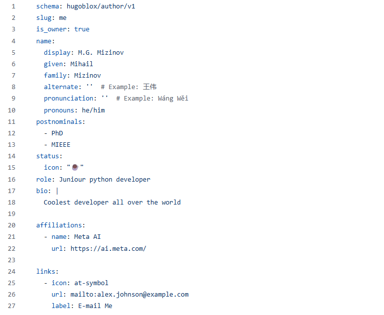

<b>
Индивидуальный проект 2 часть
</b>
<b>
Выполнил Мизинов Михаил НКАбд-04-25
</b>

---

<b>Цель работы</b>
Научиться работать с github actions

---

<b>Задание</b>
Заполнить данные на сайте

---

<b>Выполнение работы</b>

---

Заполнил информацию

---

Результат

---
<b>Вывод</b>

Научился работать с github actions
