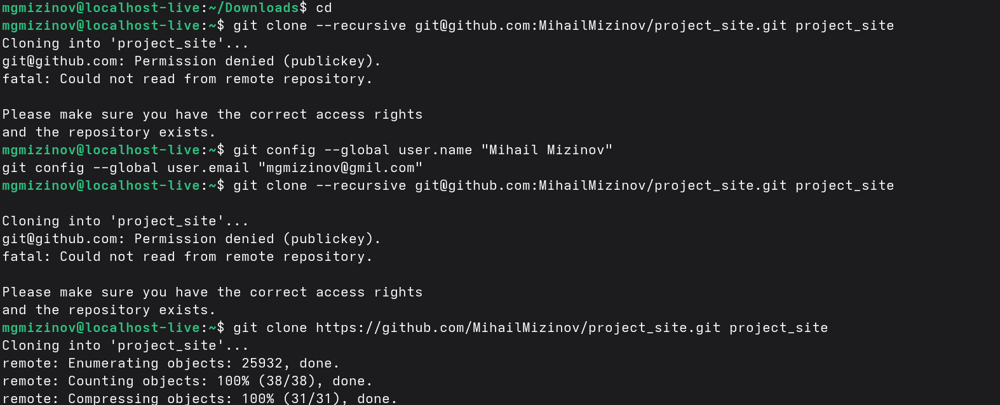
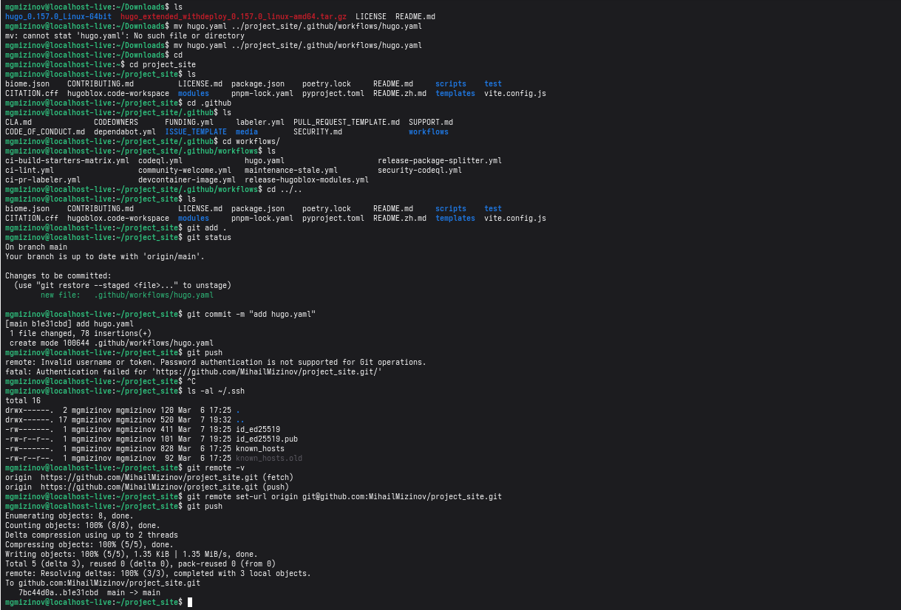

<b>
Индивидуальный проект часть 1
</b>
<b>
Выполнил Мизинов Михаил НКАбд-04-25
</b>

---

<b>  Цель работы</b>

Размещение на Github pages заготовки для персонального сайта.

---

<b>Выполнение работы</b>

Установка hugo и клонирование репозитория.

Риcунок 1 - Установка hugo и клонирование репозитория

---

Загрузка hugo.yaml

Риcунок 2 - Загрузка hugo.yaml

---

Запуск сайта

Риcунок 3 - Запуск сайта

---

<b> Вывод</b>

Разместил на Github pages заготовки для персонального сайта.
