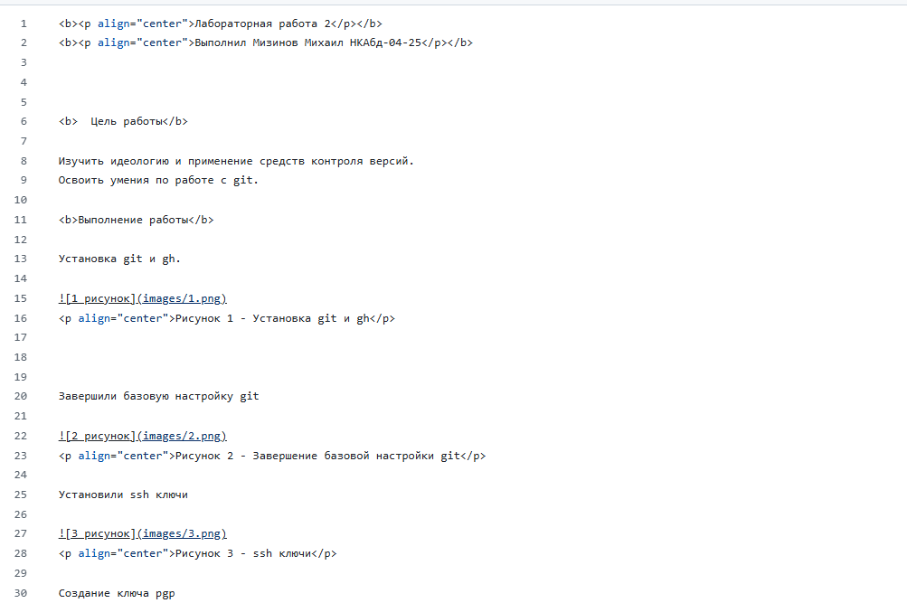
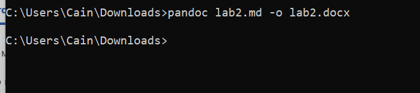
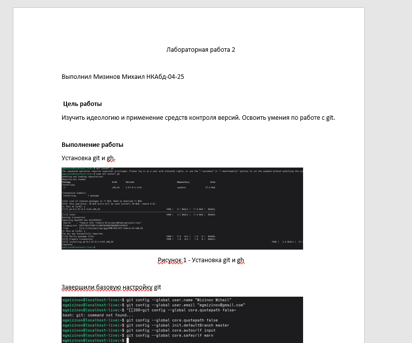

<b>
Лабораторная работа 3
</b>
<b>
Выполнил Мизинов Михаил НКАбд-04-25
</b>

---

<b>Цель работы</b>

Научиться оформлять отчёты с помощью легковесного языка разметки Markdown.

---

<b>Задание</b>

– Сделайте отчёт по предыдущей лабораторной работе в формате Markdown.

– В качестве отчёта просьба предоставить отчёты в 3 форматах: pdf, docx и md (в архиве,
поскольку он должен содержать скриншоты, Makefile и т.д.)

---

<b>Выполнение работы</b>

Отчёт Лабораторной работы 2 в md

Риcунок 1 - Отчёт в md

---

Преобразование отчёта Лабораторной работы 2 в docx и pdf через pandoc

Риcунок 2 - md в docx через pandoc

---

Риcунок 3 - Результат в word

---

<b>Выводы</b>

Научился оформлять отчёты с помощью легковесного языка разметки Markdown.
