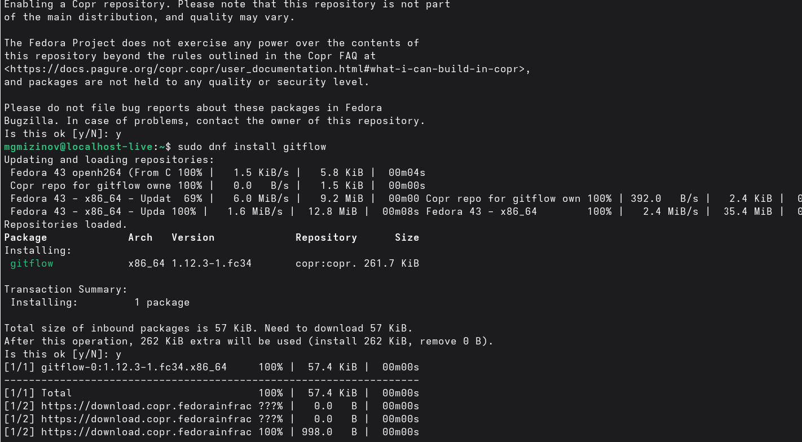
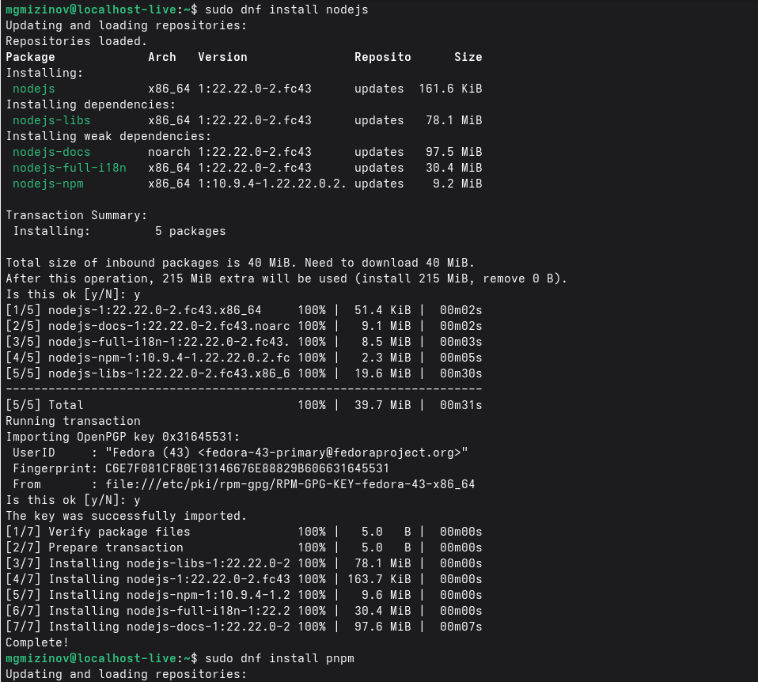
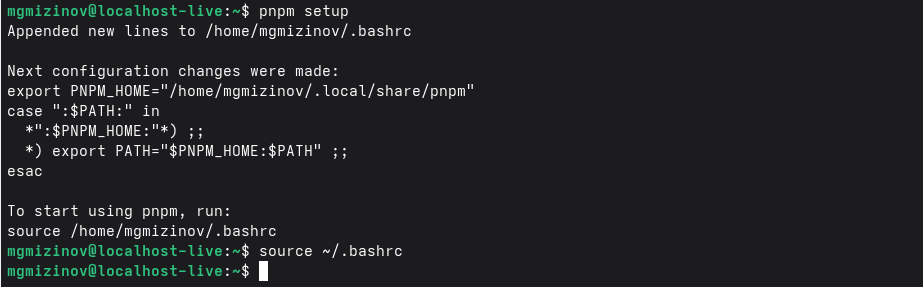
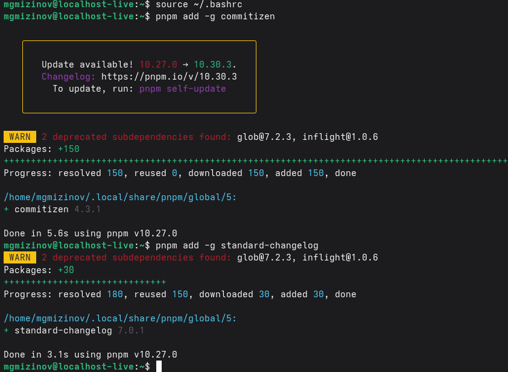
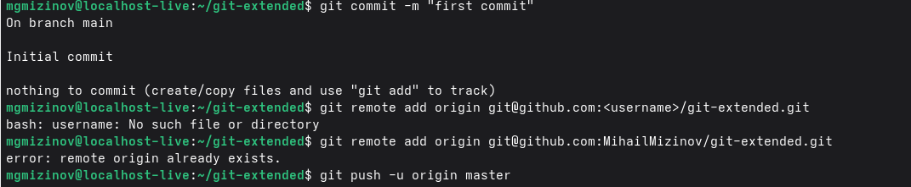
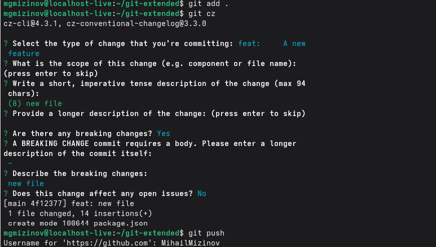
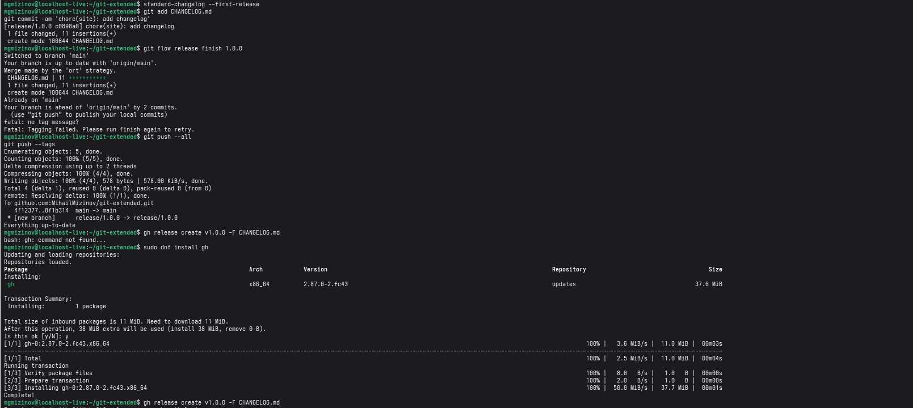
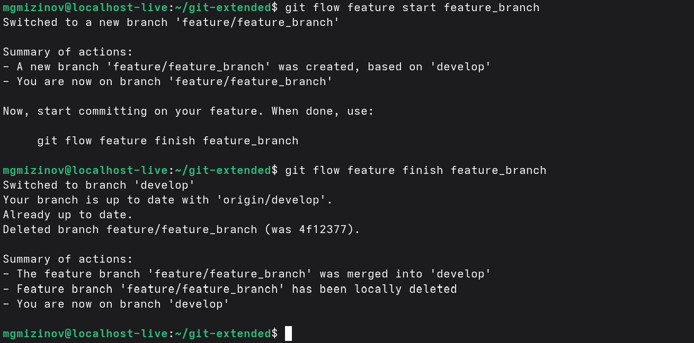
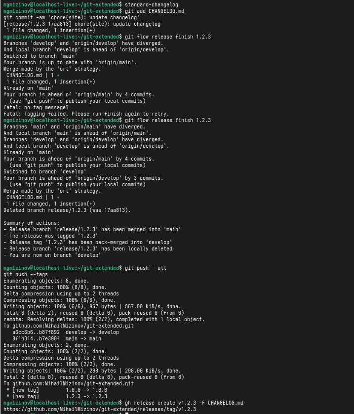

<b>
Лабораторная работа 4
</b>
<b>
Выполнил Мизинов Михаил НКАбд-04-25
</b>

<b>Цель работы</b>

Получение навыков правильной работы с репозиториями git.

<b>Задание</b>

Выполнить работу для тестового репозитория.
Преобразовать рабочий репозиторий в репозиторий с git-flow и conventional commits.

<b>Выполнение работы</b>

Установка git-flow

Установка Node.js

Настройка Node.js

Общепринятые коммиты
commitizen и standard-changelog

<b>Практический сценарий использования git</b>
Создание репозитория git

1) Подключение репозитория к github

2) Конфигурация общепринятых коммитов

3) Конфигурация git-flow

Работа с репозиторием git

1) Разработка новой функциональности
   

3) Создание релиза git-flow
   

<b>Вывод</b>

Полученил необходимые навыки правильной работы с репозиториями git.
